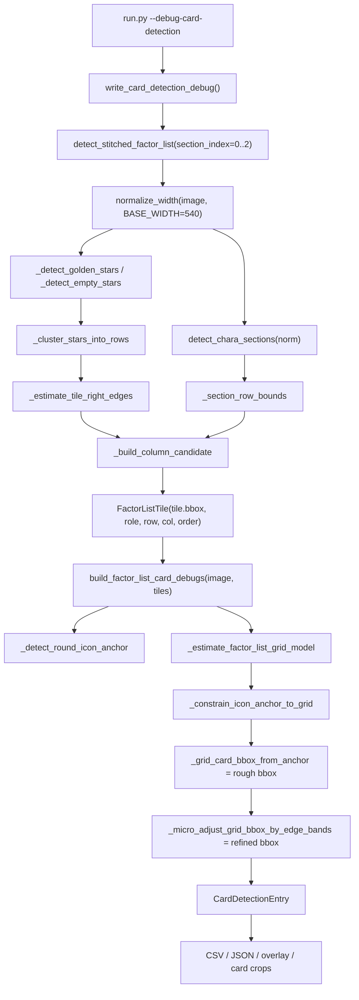

# Card BBox Detection Validation Report

この文書は、検証AIが「因子カード1枚をどう検出して切り抜いているか」を追跡するためのレポートです。

主に確認してほしい点は次の3つです。

- `tile.bbox` が最終カードbboxではなく、星行クラスタから作る初期タイル候補であること
- `role / col / row / order` がどこで割り当てられるか
- debugモードで出力している `card_bbox_rough` / `card_bbox_refined` がどの関数から来るか

## 対象ファイル

- `run.py`
  - `--debug-card-detection` CLI入口
- `src/umafactor/factor_card_detection_debug.py`
  - OCR・星数最終判定なしのcard bbox検証出力
- `src/umafactor/detection/factor_list.py`
  - stitched画像から `FactorListTile` 一覧を作る
  - `tile.bbox`, `role`, `col`, `row`, `order` を決める
- `src/umafactor/detection/sections.py`
  - 親/祖1/祖2のセクション範囲検出
- `src/umafactor/detection/stars.py`
  - 星候補から行クラスタと左右列の右端を推定
- `src/umafactor/recognition/factor_list_ocr.py`
  - `FactorListTile` からカードbboxをグリッド推定、局所edgeで微補正

## 実行方法

```powershell
python run.py datasets\test_factor_01\expected_stitched.png --ocr-mode factor-list --debug-card-detection outputs\card_debug_latest
```

このモードでは次を実行しません。

- PaddleOCR
- OCR前処理
- OCR候補選択
- 星数の最終評価
- `Submission` 変換
- Google Sheets送信

出力:

```text
outputs/card_debug_latest/
  card_detection_overlay.png
  card_detection_result.json
  card_detection_debug.csv
  cards/
    tile_000_parent_000_card.png
    ...
```

## 実行結果サマリ

`datasets/test_factor_01/expected_stitched.png` での現時点の結果です。

```json
{
  "card_count": 118,
  "role_counts": {
    "parent": 44,
    "ancestor1": 40,
    "ancestor2": 34
  },
  "column_counts": {
    "parent": {"0": 22, "1": 22},
    "ancestor1": {"0": 20, "1": 20},
    "ancestor2": {"0": 17, "1": 17}
  },
  "fallback_count": 0,
  "selected_by_counts": {
    "grid_expected": 1,
    "hough_constrained": 117
  },
  "valid_count": 118,
  "invalid_count": 0,
  "card_w": {"median": 403.0, "min": 403.0, "max": 404.0, "std": 0.4895},
  "card_h": {"median": 69.0, "min": 62.0, "max": 77.0, "std": 1.9370},
  "row_pitch": {"median": 88.5, "min": 88.25, "max": 88.75, "std": 0.1342}
}
```

## 全体フロー



## 重要な用語

### `tile.bbox`

`src/umafactor/detection/factor_list.py` の `FactorListTile.bbox` です。

これはカード外枠を精密に表す最終bboxではありません。正規化画像上で検出した星行から、カード候補の大まかな領域を作り、元画像座標へ戻したものです。

このため `tile.bbox` は次の目的に使われます。

- どのrole/row/colにカード候補があるかを持つ
- 色判定、星数初期値、丸アイコン探索の初期探索範囲に使う
- 後段のgrid推定に渡すseed bboxになる

### `card_bbox_rough`

`build_factor_list_card_debugs()` がUIグリッドと丸アイコン補助から作るカード外枠の初期推定です。

ソース上は `FactorListCardDebug.initial_card_bbox` です。

### `card_bbox_refined`

`card_bbox_rough` の上下左右近傍だけをSobel projectionで微補正した最終デバッグbboxです。

ソース上は `FactorListCardDebug.card_bbox` です。

## `tile.bbox` が決まる流れ

### 1. 画像幅を正規化する

`detect_stitched_factor_list()` は最初に入力画像を `BASE_WIDTH=540` に正規化します。

```python
norm, scale = normalize_width(image, BASE_WIDTH)
```

`scale` は `target_width / original_width` です。後で `bbox_norm` を元画像座標へ戻すために `inv = 1.0 / scale` を使います。

関連コード:

```python
def normalize_width(img: np.ndarray, target_width: int = BASE_WIDTH) -> tuple[np.ndarray, float]:
    h, w = img.shape[:2]
    if w == target_width:
        return img, 1.0
    scale = target_width / w
    new_h = int(round(h * scale))
    return cv2.resize(img, (target_width, new_h), interpolation=cv2.INTER_AREA), scale
```

### 2. 親/祖1/祖2のセクションを検出する

`detect_chara_sections(norm)` が3セクションを検出します。

通常経路:

- 画像左側15%の彩度平均を行ごとに見る
- 彩度が低い長いrunを因子グリッド領域とみなす
- 上から3つを `section_index=0,1,2` とする

fallback:

- 星行クラスタの大きなgapから3セクションを推定する

関連コード:

```python
def detect_chara_sections(img: np.ndarray) -> list[CharaSection]:
    h = img.shape[0]
    row_sat = _row_saturation(img)
    runs = _find_low_sat_runs(row_sat, LOW_SAT_THRESHOLD, MIN_GRID_RUN_LEN)
    runs_by_len = sorted(runs, key=lambda r: r[1] - r[0], reverse=True)[:3]
    grids = sorted(runs_by_len, key=lambda r: r[0])

    if len(grids) != 3:
        fallback = _detect_chara_sections_by_stars(img)
        if fallback is not None:
            return fallback
        raise RuntimeError(...)

    sections: list[CharaSection] = []
    for i, (g_start, g_end) in enumerate(grids):
        header_h = SELF_HEADER_HEIGHT if i == 0 else PARENT_HEADER_HEIGHT
        portrait_y0 = max(0, g_start - header_h)
        portrait_y1 = max(portrait_y0 + 10, g_start - 10)
        w = img.shape[1]
        sections.append(
            CharaSection(
                uma_index=i,
                factor_y_start=g_start,
                factor_y_end=g_end,
                portrait_bbox=(int(w * 0.01), portrait_y0, int(w * 0.18), portrait_y1),
            )
        )
    return sections
```

### 3. 星候補から行をクラスタリングする

`detect_stitched_factor_list()` は、正規化画像全体から金星・空星を検出します。

```python
gold = _detect_golden_stars(norm)
empty = _detect_empty_stars(norm)
rows = _cluster_stars_into_rows(gold, empty, norm.shape[1])
```

`_cluster_stars_into_rows()` は金星のy中心を基準に行クラスタを作り、画像中央で左右列に分けます。

```python
def _cluster_stars_into_rows(...):
    mid_x = img_width // 2
    gold_sorted = sorted(gold_stars, key=lambda s: s[1] + s[3] // 2)
    rows: list[list[tuple[int, int, int, int]]] = []
    for s in gold_sorted:
        cy = s[1] + s[3] // 2
        if rows:
            ref_cy = int(np.mean([r[1] + r[3] // 2 for r in rows[-1]]))
            if abs(cy - ref_cy) <= STAR_ROW_Y_TOL:
                rows[-1].append(s)
                continue
        rows.append([s])

    classified = []
    for row in rows:
        lg = [s for s in row if (s[0] + s[2] // 2) < mid_x]
        rg = [s for s in row if (s[0] + s[2] // 2) >= mid_x]
        y_center = int(np.mean([s[1] + s[3] // 2 for s in row]))
        ...
        classified.append((y_center, lg, rg, le, re_))
    return classified
```

注意点:

- 現在の `tile.bbox` 生成は、カード検出debugモードでも星行クラスタをseedにしています。
- debugモードでは最終星数判定には使いませんが、行候補の入口として星検出に依存しています。
- 検証AIには、この点を重点的に確認してほしいです。

### 4. 左右列の `x_right` を推定する

`_estimate_tile_right_edges(rows)` は、各列の金星bbox右端からカード候補の右端を推定します。

```python
def _estimate_tile_right_edges(classified_rows):
    left_maxes: list[int] = []
    right_maxes: list[int] = []
    for _y, lg, rg, _le, _re in classified_rows:
        if lg:
            left_maxes.append(max(s[0] + s[2] for s in lg))
        if rg:
            right_maxes.append(max(s[0] + s[2] for s in rg))

    x_L1 = (
        int(np.percentile(left_maxes, TILE_RIGHT_PERCENTILE)) + TILE_RIGHT_PADDING
        if len(left_maxes) >= MIN_STARS_PER_COLUMN
        else None
    )
    x_R1 = (
        int(np.percentile(right_maxes, TILE_RIGHT_PERCENTILE)) + TILE_RIGHT_PADDING
        if len(right_maxes) >= MIN_STARS_PER_COLUMN
        else None
    )
    return x_L1, x_R1
```

ここで使われる主な定数:

```python
TILE_WIDTH = 175
TILE_HEIGHT = 27
STAR_Y_IN_TILE = 19
TILE_RIGHT_PADDING = 36
TILE_RIGHT_PERCENTILE = 90
MIN_STARS_PER_COLUMN = 3
```

### 5. セクション範囲内の行だけを採用する

`_section_row_bounds()` がセクションごとのy範囲を返します。

```python
def _section_row_bounds(sections, section_index: int, image_height: int) -> tuple[int, int]:
    section = sections[section_index]
    y_min = max(0, section.factor_y_start - PARENT_ROW0_LOOKBACK - 30)
    y_max = min(image_height, section.factor_y_end + TILE_HEIGHT + 30)
    if section_index + 1 < len(sections):
        next_y_min = max(0, sections[section_index + 1].factor_y_start - PARENT_ROW0_LOOKBACK - 30)
        y_max = min(y_max, max(y_min, next_y_min - 1))
    return y_min, y_max
```

### 6. `_build_column_candidate()` で `bbox_norm` を作る

ここが `tile.bbox` の直接の元になります。

```python
def _build_column_candidate(
    norm_img: np.ndarray,
    *,
    row_index: int,
    col_index: int,
    y_center: int,
    x_right: int,
) -> _ColumnRowCandidate:
    x0 = max(0, x_right - TILE_WIDTH)
    x1 = min(norm_img.shape[1], x_right)
    y0 = max(0, y_center - STAR_Y_IN_TILE)
    y1 = min(norm_img.shape[0], y0 + TILE_HEIGHT)
    bbox_norm = (x0, y0, x1, y1)
    tile = norm_img[y0:y1, x0:x1]
    color = detect_factor_color(tile) if tile.size else "white"
    star_debug = detect_star_slots_from_card(norm_img, bbox_norm)
    return _ColumnRowCandidate(
        row_index=row_index,
        col_index=col_index,
        y_center=y_center,
        star=star_debug.star_count,
        bbox_norm=bbox_norm,
        color=color,
    )
```

式としては次の通りです。

```text
bbox_norm.x0 = x_right - TILE_WIDTH
bbox_norm.x1 = x_right
bbox_norm.y0 = star_row_y_center - STAR_Y_IN_TILE
bbox_norm.y1 = bbox_norm.y0 + TILE_HEIGHT
```

このbboxは「星位置を基準にした薄いタイル候補」であり、カード全体外枠ではありません。

### 7. `bbox_norm` を元画像座標へ戻して `tile.bbox` にする

```python
inv = 1.0 / scale if scale else 1.0
...
bbox=_scale_bbox(candidate.bbox_norm, inv, image.shape)
```

`_scale_bbox()`:

```python
def _scale_bbox(
    bbox: tuple[int, int, int, int],
    scale: float,
    image_shape: tuple[int, ...],
) -> tuple[int, int, int, int]:
    x0, y0, x1, y1 = bbox
    height, width = image_shape[:2]
    return (
        max(0, min(width, int(round(x0 * scale)))),
        max(0, min(height, int(round(y0 * scale)))),
        max(0, min(width, int(round(x1 * scale)))),
        max(0, min(height, int(round(y1 * scale)))),
    )
```

したがって `tile.bbox` は元画像座標です。

## `role / col / row / order` の割り当て

`detect_stitched_factor_list()` 内で割り当てています。

### role

`section_index` から固定変換します。

```python
def _role_for_section(section_index: int) -> FactorListRole:
    if section_index == 0:
        return "parent"
    if section_index == 1:
        return "ancestor1"
    return "ancestor2"
```

### col

星行クラスタを画像中央で左右に分けたあと、左列は `col_index=0`、右列は `col_index=1` です。

```python
if left_gold:
    left_rows.append(
        _build_column_candidate(
            norm,
            row_index=len(left_rows),
            col_index=0,
            y_center=y_center,
            x_right=x_left1,
        )
    )
if right_gold:
    right_rows.append(
        _build_column_candidate(
            norm,
            row_index=len(right_rows),
            col_index=1,
            y_center=y_center,
            x_right=x_right1,
        )
    )
```

### row

左列と右列で独立に `row_index=len(left_rows)` / `len(right_rows)` を割り当てます。

理由:

- 緑カードなどで左右の星位置が完全に同じyにならないケースがある
- 左右列を独立に扱うことで、片側だけの行ずれに引っ張られにくくしている

### order

`row_index` の昇順で、左列、右列の順に追加します。

```python
role = _role_for_section(section_index)
tiles: list[FactorListTile] = []
order = 0
for row_index in range(max(len(left_rows), len(right_rows))):
    for candidate_rows in (left_rows, right_rows):
        if row_index >= len(candidate_rows):
            continue
        candidate = candidate_rows[row_index]
        tiles.append(
            FactorListTile(
                order=order,
                section_index=section_index,
                role=role,
                row_index=row_index,
                col_index=candidate.col_index,
                color=candidate.color,
                star=candidate.star,
                bbox=_scale_bbox(candidate.bbox_norm, inv, image.shape),
                bbox_norm=candidate.bbox_norm,
            )
        )
        order += 1
```

このため、通常は次の順になります。

```text
row 0 left  -> order 0
row 0 right -> order 1
row 1 left  -> order 2
row 1 right -> order 3
...
```

## 最終カードbboxの生成

`tile.bbox` から直接カードを切るのではなく、後段で `card_bbox_refined` を作ります。

入口:

```python
debug_by_tile = build_factor_list_card_debugs(image_bgr, detection.tiles)
```

### `build_factor_list_card_debugs()`

```python
def build_factor_list_card_debugs(
    image: np.ndarray,
    tiles: Sequence[FactorListTile],
) -> dict[tuple[int, int, int, int], FactorListCardDebug]:
    tile_list = list(tiles)
    if not tile_list:
        return {}

    anchors: dict[tuple[int, int, int, int], _IconAnchor] = {}
    for tile in tile_list:
        icon = _detect_round_icon_anchor(image, tile)
        if icon is None:
            continue
        anchors[_tile_debug_key(tile)] = icon

    model = _estimate_factor_list_grid_model(image, tile_list, anchors)
    debug_by_tile: dict[tuple[int, int, int, int], FactorListCardDebug] = {}
    for tile in tile_list:
        key = _tile_debug_key(tile)
        detected_anchor = anchors.get(key)
        anchor = _constrain_icon_anchor_to_grid(tile, detected_anchor, model)
        grid_bbox = _grid_card_bbox_from_anchor(image, tile, anchor, model)
        corrected_bbox, accepted_edges, rejected_edges = _micro_adjust_grid_bbox_by_edge_bands(
            image,
            grid_bbox,
            anchor,
            model,
        )
        if not _is_grid_card_bbox_valid(corrected_bbox, grid_bbox, anchor, model):
            corrected_bbox = grid_bbox
            accepted_edges = ()
        ...
        debug_by_tile[key] = FactorListCardDebug(
            card_bbox=corrected_bbox,
            initial_card_bbox=grid_bbox,
            ...
        )
    return debug_by_tile
```

処理の意味:

1. `tile.bbox` 周辺で丸アイコン候補を探す
2. ただしHough中心をそのまま最終中心にはしない
3. 全tileから列x、カード幅、高さ、丸アイコン半径などのgrid modelを推定する
4. grid modelから `card_bbox_rough` を作る
5. bbox外周付近だけでSobel projectionし、上下左右を数pxだけ補正する
6. 妥当性チェックに失敗したら補正を捨てる

## 丸アイコン検出の扱い

丸アイコンはカードbboxの主決定要因ではなく、row存在確認・grid推定の補助です。

現在のHough検出:

```python
circles = cv2.HoughCircles(
    gray,
    cv2.HOUGH_GRADIENT,
    dp=1.2,
    minDist=max(8, int(round(height * 0.42))),
    param1=80,
    param2=14,
    minRadius=min_radius,
    maxRadius=max_radius,
)
```

Hough raw centerは、expected centerから近い場合だけ30%混ぜます。遠い場合はgrid expected centerを採用します。

```python
dx = abs(raw_center[0] - expected[0])
dy = abs(raw_center[1] - expected[1])
tol_x = max(4.0, tile_width * 0.055, model.icon_radius_median * 0.55)
tol_y = max(4.0, tile_height * 0.16, model.icon_radius_median * 0.55)
if dx <= tol_x and dy <= tol_y:
    final_cx = int(round(expected[0] * 0.70 + raw_center[0] * 0.30))
    final_cy = int(round(expected[1] * 0.70 + raw_center[1] * 0.30))
    selected_by = "hough_constrained"
else:
    final_cx, final_cy = expected
    selected_by = "grid_expected"
```

## Grid model推定

`_estimate_factor_list_grid_model()` は、`tile.bbox` とHough anchor群からカード全体の幾何を推定します。

```python
tile_widths = [max(1, tile.bbox[2] - tile.bbox[0]) for tile in tiles]
tile_heights = [max(1, tile.bbox[3] - tile.bbox[1]) for tile in tiles]
tile_width_median = _median_or_default(tile_widths, 320.0)
tile_height_median = _median_or_default(tile_heights, 52.0)
radii = [anchor.radius for anchor in anchors.values()]
icon_radius_median = _median_or_default(radii, tile_height_median * 0.34)
```

列ごとの丸アイコンx:

```python
left_icon_x = _column_icon_x(tiles, anchors, col=0, fallback_rel=0.18)
right_icon_x = _column_icon_x(tiles, anchors, col=1, fallback_rel=0.09)
```

列ごとのカード左端:

```python
left_card_x1 = _column_card_left_x(tiles, col=0, fallback=left_icon_x - icon_radius_median * 0.90)
right_card_x1 = _column_card_left_x(tiles, col=1, fallback=right_icon_x - icon_radius_median * 0.90)
card_width_median = max(
    tile_width_median * 1.08,
    (right_card_x1 - left_card_x1) - icon_radius_median * 0.55,
)
```

## `card_bbox_rough` の生成

`_grid_card_bbox_from_anchor()` が作ります。

```python
def _grid_card_bbox_from_anchor(image, tile, anchor, model):
    if tile.col_index == 0:
        x0 = model.left_column_card_x1
        x1 = model.left_column_card_x2
    else:
        x0 = model.right_column_card_x1
        x1 = model.right_column_card_x2
    r = model.icon_radius_median
    y0 = anchor.cy - r * 1.75
    y1 = y0 + model.card_height_median
    return _clip_nonempty_bbox(
        (int(round(x0)), int(round(y0)), int(round(x1)), int(round(y1))),
        image.shape,
    )
```

式としては次の通りです。

```text
x0 = role内/列内で推定された column_card_x1
x1 = role内/列内で推定された column_card_x2
y0 = constrained_anchor_cy - median_icon_radius * 1.75
y1 = y0 + median_card_height
```

## `card_bbox_refined` の生成

`_micro_adjust_grid_bbox_by_edge_bands()` が、推定bboxの外周付近だけを見て微補正します。

禁止していること:

- 画面全体にCanny/HoughLinesPをかけて外枠を自由探索する
- 文字、星、内部線を外枠として採用する

現在の補正:

```python
top, top_rejected = _snap_horizontal_edge_band(
    image,
    expected_y=y0,
    x_range=(x0 + int(round(width * 0.18)), x1 - int(round(width * 0.04))),
    tolerance=max(3, int(round(r * 0.35))),
)
bottom, bottom_rejected = _snap_horizontal_edge_band(
    image,
    expected_y=y1,
    x_range=(x0 + int(round(width * 0.18)), x1 - int(round(width * 0.04))),
    tolerance=max(3, int(round(r * 0.42))),
)
left, left_rejected = _snap_vertical_edge_band(
    image,
    expected_x=x0,
    y_range=(y0 + int(round(r * 0.60)), y1 - int(round(r * 0.35))),
    tolerance=max(3, int(round(r * 0.30))),
)
right, right_rejected = _snap_vertical_edge_band(
    image,
    expected_x=x1,
    y_range=(y0 + int(round(r * 0.60)), y1 - int(round(r * 0.35))),
    tolerance=max(3, int(round(r * 0.30))),
)
```

`_snap_horizontal_edge_band()` / `_snap_vertical_edge_band()` は、狭いband内でSobel projectionを取り、expected位置に近い候補を選びます。

```python
def _snap_horizontal_edge_band(...):
    crop = image[y0:y1, x0:x1]
    gray = cv2.cvtColor(_ensure_bgr_u8(crop), cv2.COLOR_BGR2GRAY)
    grad = cv2.Sobel(gray, cv2.CV_32F, 0, 1, ksize=3)
    projection = np.abs(grad).mean(axis=1)
    candidates = _projection_candidates(projection, y0, expected_y, tolerance)
    chosen = candidates[0]
    rejected = tuple((x0, y, x1, y) for y in candidates[1:6])
    return chosen, rejected
```

妥当性チェック:

```python
def _is_grid_card_bbox_valid(bbox, grid_bbox, anchor, model) -> bool:
    x0, y0, x1, y1 = bbox
    width = max(1, x1 - x0)
    height = max(1, y1 - y0)
    grid_height = max(1, grid_bbox[3] - grid_bbox[1])
    if not (x0 <= anchor.cx <= x1 and y0 <= anchor.cy <= y1):
        return False
    if abs(height - grid_height) > max(4.0, model.icon_radius_median * 0.75):
        return False
    if abs(width - model.card_width_median) > max(6.0, model.icon_radius_median * 1.2):
        return False
    return True
```

## Debug出力の作り方

`write_card_detection_debug()`:

```python
def write_card_detection_debug(image, output_dir, *, expected_path=None):
    image_bgr, image_path = _load_image_input(image)
    detections = _detect_factor_list_sections(image_bgr)
    entries = _build_card_detection_entries(image_bgr, detections)
    _assign_row_pitch(entries)
    _validate_entries(entries, image_bgr.shape)

    expected = _load_expected_bboxes(expected_path)
    evaluation = _evaluate_expected(entries, expected) if expected else None

    _write_card_crops(image_bgr, entries, cards_dir)
    cv2.imwrite(str(overlay_path), _make_card_detection_overlay(image_bgr, entries))
    _write_debug_csv(csv_path, entries)
    result_json_path.write_text(json.dumps(summary, ensure_ascii=False, indent=2), encoding="utf-8")
```

sectionごとに `detect_stitched_factor_list()` を呼ぶ:

```python
def _detect_factor_list_sections(image_bgr: np.ndarray) -> list[FactorListDetection]:
    detections: list[FactorListDetection] = []
    for section_index in range(3):
        try:
            detections.append(detect_stitched_factor_list(image_bgr, section_index=section_index))
        except IndexError:
            break
        except RuntimeError:
            if section_index == 0:
                raise
            continue
    return detections
```

`CardDetectionEntry` への変換:

```python
def _entry_from_tile_debug(tile: FactorListTile, debug: FactorListCardDebug) -> CardDetectionEntry:
    rough = debug.initial_card_bbox
    refined = debug.card_bbox
    rx0, ry0, rx1, ry1 = rough
    x0, y0, x1, y1 = refined
    hough_count = len(debug.rejected_icon_bboxes) + (1 if debug.hough_raw_center is not None else 0)
    accepted_edges = tuple(debug.hough_horizontal_lines) + tuple(debug.hough_vertical_lines)
    return CardDetectionEntry(
        role=tile.role,
        index=tile.order,
        col=tile.col_index,
        row=tile.row_index,
        card_bbox_rough=rough,
        card_bbox_refined=refined,
        tile_bbox=tile.bbox,
        card_w=max(0, x1 - x0),
        card_h=max(0, y1 - y0),
        ...
    )
```

## CSV列

`card_detection_debug.csv` は次を出力します。

```text
role
index
col
row
card_bbox_rough
card_bbox_refined
card_w
card_h
row_pitch
hough_candidate_count
hough_raw_center
grid_expected_center
final_anchor_center
selected_by
fallback_used
refine_top_delta
refine_bottom_delta
refine_left_delta
refine_right_delta
valid
invalid_reason
```

## JSON構造

`card_detection_result.json` は概要と全カード明細を持ちます。

概要:

```json
{
  "image_path": "...",
  "image_size": {"width": 1039, "height": 5446},
  "card_count": 118,
  "role_counts": {"parent": 44, "ancestor1": 40, "ancestor2": 34},
  "column_counts": {"parent": {"0": 22, "1": 22}},
  "fallback_count": 0,
  "selected_by_counts": {"hough_constrained": 117, "grid_expected": 1},
  "card_w": {"median": 403.0, "min": 403.0, "max": 404.0, "std": 0.4895},
  "card_h": {"median": 69.0, "min": 62.0, "max": 77.0, "std": 1.9370},
  "row_pitch": {"median": 88.5, "min": 88.25, "max": 88.75, "std": 0.1342}
}
```

カード明細:

```json
{
  "role": "parent",
  "index": 0,
  "col": 0,
  "row": 0,
  "tile_bbox": [142, 538, 479, 590],
  "card_bbox_rough": [186, 536, 591, 606],
  "card_bbox_refined": [187, 536, 591, 604],
  "card_w": 404,
  "card_h": 68,
  "row_pitch": 88.5,
  "hough_raw_center": [200, 568],
  "grid_expected_center": [203, 568],
  "final_anchor_center": [202, 568],
  "selected_by": "hough_constrained",
  "fallback_used": false,
  "valid": true
}
```

## 手動正解bboxとの比較

`tests/fixtures/card_bbox_expected.json` が存在する場合、自動で読み込みます。

対応形式:

```json
{
  "cards": [
    {"role": "parent", "index": 0, "bbox": [187, 536, 591, 604]}
  ]
}
```

または:

```json
[
  {"role": "parent", "index": 0, "bbox": [187, 536, 591, 604]}
]
```

評価内容:

- mean IoU
- min IoU
- IoU < 0.85 の一覧
- invalid card一覧

関連コード:

```python
def _evaluate_expected(entries, expected):
    values: list[float] = []
    below: list[dict[str, Any]] = []
    missing: list[dict[str, Any]] = []
    for entry in entries:
        expected_bbox = expected.get((entry.role, entry.index))
        if expected_bbox is None:
            missing.append({"role": entry.role, "index": entry.index})
            continue
        value = _iou(entry.card_bbox_refined, expected_bbox)
        entry.iou = value
        values.append(value)
        if value < 0.85:
            below.append({"role": entry.role, "index": entry.index, "iou": value})
    return {
        "expected_count": len(expected),
        "matched_count": len(values),
        "mean_iou": float(np.mean(values)) if values else None,
        "min_iou": float(np.min(values)) if values else None,
        "iou_below_0_85": below,
        ...
    }
```

## 検証AIに見てほしい本命ポイント

### 1. `tile.bbox` seedが星行依存でよいか

現状のcard detection debugモードはOCRと最終星数判定を切り離していますが、`tile.bbox` 生成のseedは星行クラスタです。

懸念:

- 星検出が失敗するとカード候補行そのものが欠落する
- 星以外のUIに転用する汎用性はまだ低い
- 「カード1枚を安定して切る」目的に対して、行候補の入口が星に依存している

ただし、今回のデバッグ目的では `tile.bbox` と `card_bbox_refined` を分離して可視化できるため、どこが崩れているかは追跡しやすくなっています。

### 2. role境界が正しく切れているか

`detect_chara_sections()` が3セクションを返し、`_section_row_bounds()` が次セクション開始前まででy範囲を切ります。

検証観点:

- 祖1末尾と祖2先頭が混ざらないか
- `PARENT_ROW0_LOOKBACK` が過剰で前セクションを拾わないか
- fallbackの星group分割で3セクションが安定するか

### 3. row/col/orderの対応が期待通りか

`row_index` は左右列で独立採番、`order` は行ごとに左、右の順です。

検証観点:

- 左右どちらかに欠落がある場合、`order` と `row_index` の解釈が破綻しないか
- DB登録やOCR結果の順序が `order` 前提でよいか

### 4. 最終カードcropは `tile.bbox` ではなく `card_bbox_refined`

debug cropは `entry.card_bbox_refined` で切っています。

```python
def _write_card_crops(image_bgr, entries, cards_dir):
    for sequential_index, entry in enumerate(entries):
        crop = _crop(image_bgr, entry.card_bbox_refined)
        ...
```

検証観点:

- `card_bbox_refined` が文字・星・丸アイコンを欠かさず含んでいるか
- 上下端が内部線に引っ張られていないか
- 最終OCR ROIやstar ROIへ戻す時、このbboxを基準にして安定するか

## 既知の制約

- `tile.bbox` の入口は星検出です。完全なカード外枠検出ではありません。
- `card_bbox_refined` のedge補正はSobel projectionであり、補正量は小さく抑えています。
- 手動正解bboxがまだ無いため、現時点ではIoU評価は未実施です。
- `row_pitch` はdebug出力側で `card_bbox_refined` の中心y差分から再計算しています。検出本体のrow pitch推定とは別です。

## 推奨される次の検証

1. `outputs/card_debug_latest/cards/` のcropを目視確認する
2. `tests/fixtures/card_bbox_expected.json` に10から20件程度の手動bboxを作る
3. IoUを確認し、特に以下を重点確認する
   - parent row 0 の青/赤カード
   - 緑カード
   - セクション境界付近
   - 末尾行
4. `tile.bbox` と `card_bbox_refined` の差分を見て、seedが悪いのかgrid/edge補正が悪いのかを分ける
5. 必要なら次フェーズで、星行依存ではない行候補検出へ置き換える
