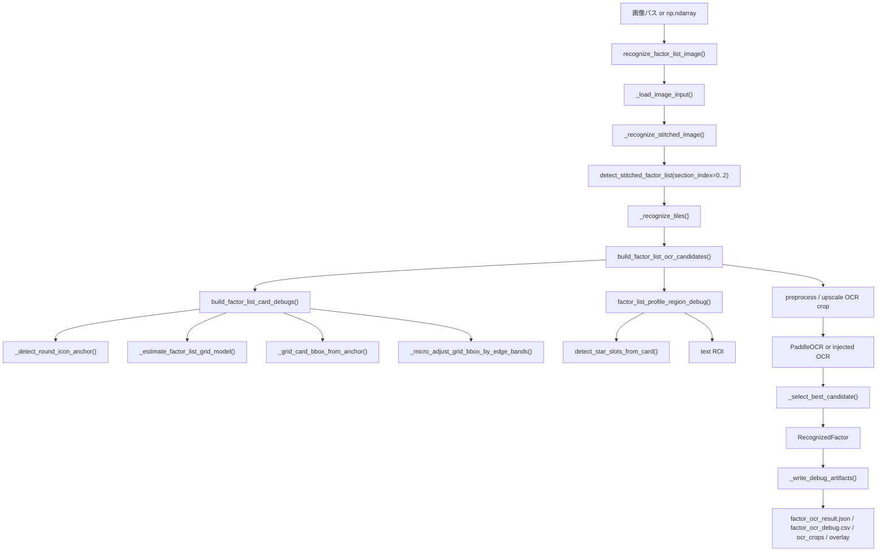
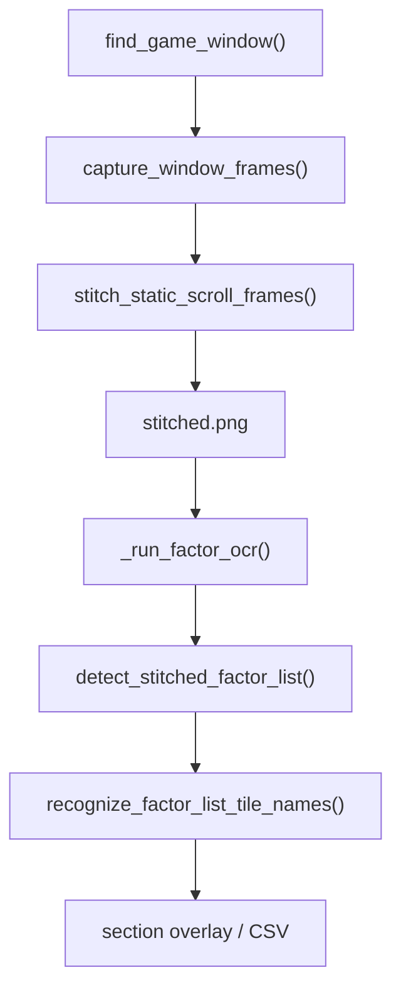

# 因子カード検出・丸アイコン検出・OCR ROI抽出 現状フロー

作成日: 2026-05-17

この文書は、現在の `factor-list` OCR フローにおける因子カード bbox 検出、丸アイコン検出、OCR text ROI 抽出、star ROI 抽出、debug overlay 出力の実装内容を整理したものです。

目的は、overlay 上の丸アイコン描画位置が実アイコン中心からずれて見える原因を切り分けることです。特に、以下を区別します。

- HoughCircles の検出誤り
- tile bbox / card bbox からの期待位置推定誤差
- crop offset の足し戻しミス
- overlay 描画時の座標系ミス

## 1. 全体処理フロー

### 1.1 静的画像入力の factor-list OCR

`run.py --ocr-mode factor-list` またはライブラリ API から実行する場合の主経路です。



担当関数:

| 処理 | 主な担当 |
|---|---|
| 入力画像読み込み | `src/umafactor/factor_list_pipeline.py::recognize_factor_list_image()`, `_load_image_input()` |
| スクロール画像結合 | `src/umafactor/factor_list_pipeline.py::recognize_factor_list_frames()`, `src/umafactor/capture/static_stitch.py::stitch_static_scroll_frames()` |
| セクション検出 | `src/umafactor/detection/factor_list.py::detect_stitched_factor_list()` 内で `detect_chara_sections()` を使用 |
| 親/祖父母 role 分割 | `src/umafactor/detection/factor_list.py::_role_for_section()` |
| 因子カード候補検出 | `src/umafactor/detection/factor_list.py::detect_stitched_factor_list()`, `_build_column_candidate()` |
| 丸アイコン検出 | `src/umafactor/recognition/factor_list_ocr.py::_detect_round_icon_anchor()` |
| card bbox 生成 | `build_factor_list_card_debugs()`, `_estimate_factor_list_grid_model()`, `_grid_card_bbox_from_anchor()` |
| edge 補正 | `_micro_adjust_grid_bbox_by_edge_bands()`, `_snap_horizontal_edge_band()`, `_snap_vertical_edge_band()` |
| text ROI 生成 | `factor_list_profile_region_debug()` |
| star ROI 生成 | `src/umafactor/detection/star_slots.py::detect_star_slots_from_card()` |
| OCR 実行 | `recognize_factor_list_tile_candidates()`, `_recognize_candidate_crops()` |
| debug overlay 生成 | `src/umafactor/debug/overlay.py::write_factor_ocr_overlay()`, `make_factor_ocr_overlay()` |

### 1.2 ライブキャプチャ経路

Steam 版ウマ娘の実地テスト用 CLI は `scripts/capture_factor_list.py` です。



注意点:

- `scripts/capture_factor_list.py` は評価・実験用スクリプトです。
- 新しい独立 pipeline の `FactorOcrResult` / `RecognizedFactor` とは別に、旧評価用 overlay 関数も残っています。
- 本文書では、現在の本体側 `factor_list_pipeline.py` と `recognition/factor_list_ocr.py` の実装を中心に説明します。

## 2. 関連ファイルと関数一覧

### 因子カードbbox検出

- `src/umafactor/detection/factor_list.py`
  - `detect_stitched_factor_list()`
  - `_build_column_candidate()`
  - `_scale_bbox()`
- `src/umafactor/recognition/factor_list_ocr.py`
  - `build_factor_list_card_debugs()`
  - `factor_list_card_region_debug()`
  - `_fixed_ratio_card_bbox()`

### 丸アイコン検出

- `src/umafactor/recognition/factor_list_ocr.py`
  - `_detect_round_icon_anchor()`
  - `_is_icon_candidate_plausible()`
  - `_circle_bbox()`
  - `_circle_edge_score()`

### HoughCircles / 円検出

現役経路:

- `_detect_round_icon_anchor()`
  - `cv2.HoughCircles()` を使用
  - tile bbox 周辺の search crop に対して実行

残存レガシー経路:

- `_detect_round_icon_in_card()`
  - 現在の主経路からは呼ばれていません。
  - card bbox 内で円検出する旧方式です。

### edge検出

現役経路:

- `_micro_adjust_grid_bbox_by_edge_bands()`
- `_snap_horizontal_edge_band()`
- `_snap_vertical_edge_band()`
- `_projection_candidates()`

使用手法:

- Sobel projection
- 全カード領域ではなく、推定 bbox の top / bottom / left / right 近傍の細い band のみ

残存レガシー経路:

- `_detect_hough_card_bbox()`
- `_detect_local_hough_lines()`
- `_snap_x_from_vertical_lines()`
- `_snap_y_from_horizontal_lines()`

これらは `cv2.Canny()` + `cv2.HoughLinesP()` を使いますが、現在の `build_factor_list_card_debugs()` からは呼ばれていません。

### bbox補正

現役:

- `_micro_adjust_grid_bbox_by_edge_bands()`
- `_is_grid_card_bbox_valid()`

残存:

- `_refine_card_bbox_by_edges()`
- `_is_refined_card_bbox_valid()`

### text ROI計算

- `factor_list_profile_region_debug()`
- `_profile_from_variant()`
- `_profile_bounds()`
- `_text_icon_right_rel()`
- `_estimate_text_icon_exclusion_bbox()`
- `_estimate_visible_star_top()`
- `_refine_colored_text_left()`

### star ROI計算

- `src/umafactor/detection/star_slots.py`
  - `detect_star_slots_from_card()`
  - `_fixed_slot_bboxes()`
  - `_estimate_fixed_star_center_y()`
  - `_star_masks()`
  - `_yellow_ratio()`

### debug overlay描画

- `src/umafactor/debug/overlay.py`
  - `write_factor_ocr_overlay()`
  - `make_factor_ocr_overlay()`
  - `_draw_factor_label()`

## 3. 座標系の説明

### 3.1 元画像座標

OCR pipeline の多くは、結合済み画像そのものの座標を使います。

- 原点: 画像左上
- x: 右方向
- y: 下方向
- 単位: pixel

`recognize_factor_list_image()` では、入力画像を `_load_image_input()` で BGR `np.ndarray` に変換し、以降はこの画像座標を基準にします。

### 3.2 normalize_width 後の座標

`detect_stitched_factor_list()` では、まず `normalize_width(image, BASE_WIDTH)` を呼びます。

ここで:

- `norm`: 幅を `BASE_WIDTH` に揃えた画像
- `scale`: 元画像幅から正規化画像幅への倍率

概念的には以下です。

```text
norm_x = original_x * scale
norm_y = original_y * scale
original_x = norm_x / scale
original_y = norm_y / scale
```

検出された `bbox_norm` は正規化画像座標です。
`_scale_bbox(candidate.bbox_norm, inv, image.shape)` で元画像座標へ戻します。

```text
inv = 1.0 / scale
global_x0 = round(norm_x0 * inv)
global_y0 = round(norm_y0 * inv)
global_x1 = round(norm_x1 * inv)
global_y1 = round(norm_y1 * inv)
```

`FactorListTile` は両方を保持します。

- `bbox_norm`: 正規化画像座標
- `bbox`: 元画像座標

丸アイコン検出以降は基本的に `tile.bbox`、つまり元画像座標を使います。

### 3.3 role別crop画像座標

現在の本体側 `factor_list_pipeline.py` では、role別に画像を切り出してから処理しているわけではありません。

`section_index=0..2` を変えて `detect_stitched_factor_list()` を呼びますが、画像自体は常に結合済み元画像です。

したがって、本体側の role 処理で追加の `offset_x`, `offset_y` は発生しません。

例外:

- 評価スクリプトや古い overlay スクリプトでは、見た目上 role ごとの overlay や panel を作る処理があります。
- ただし、`FactorListTile.bbox` / `RecognizedFactor.bbox` は元画像座標のままです。

### 3.4 card crop内ローカル座標

debug crop 保存時にだけ card crop ローカル座標が使われます。

`_write_debug_ocr_crops()` で:

```text
card_crop = image_bgr[card_y0:card_y1, card_x0:card_x1]
```

card crop内ローカル座標への変換:

```text
local_x = global_x - card_x0
local_y = global_y - card_y0
```

`*_edge_bands.png` は `_draw_edge_debug_crop()` で、global edge line を card crop ローカル座標へ引き戻して描画します。

```text
draw_x = edge_global_x - card_x0
draw_y = edge_global_y - card_y0
```

### 3.5 Hough検出用画像座標

丸アイコン検出では、`_detect_round_icon_anchor()` が `tile.bbox` 周辺から `search_bbox` を作ります。

```text
search_x0 = tile_x0 - 0.08 * tile_w
search_y0 = tile_y0 - 0.28 * tile_h
search_x1 = tile_x0 + 0.32 * tile_w
search_y1 = tile_y1 + 0.28 * tile_h
```

実際の HoughCircles 入力は:

```text
search = image[search_y0:search_y1, search_x0:search_x1]
gray = cvtColor(search, BGR2GRAY)
gray = GaussianBlur(gray, (5, 5), 0)
```

重要:

- HoughCircles 前に明示的な resize はしていません。
- HoughCircles の戻り値は `search` crop のローカル座標です。
- global への変換は `search_bbox` の offset を足しています。

```text
global_cx = search_x0 + local_cx
global_cy = search_y0 + local_cy
```

この点を見る限り、現役の `_detect_round_icon_anchor()` では「resize倍率を戻し忘れる」タイプのバグは起きにくいです。

### 3.6 OCR投入用crop座標

`factor_list_profile_region_debug()` が `text_bbox` を元画像座標で返します。

`build_factor_list_ocr_candidates()` で:

```text
raw_crop = image[roi_y0:roi_y1, roi_x0:roi_x1]
upscaled_crop = upscale_factor_list_ocr_crop(raw_crop, ...)
preprocessed_crop = preprocess_upscaled_factor_list_ocr_crop(upscaled_crop, ...)
```

OCR crop 内では座標はローカル化されますが、`FactorListOcrCandidate.roi_bbox` には元画像座標の bbox が保持されます。

### 3.7 overlay描画用座標

`src/umafactor/debug/overlay.py::make_factor_ocr_overlay()` は、入力画像を PIL RGBA に変換しただけで、拡大縮小や座標変換を行いません。

```text
overlay_x = global_x
overlay_y = global_y
```

したがって、overlay 上の図形位置がずれる場合、主因は overlay 側の scale / offset ではなく、`RecognizedFactor` に入っている bbox / icon bbox / edge line 自体がずれている可能性が高いです。

## 4. 丸アイコン検出の詳細

### 4.1 現役の丸アイコン検出

担当関数:

- `src/umafactor/recognition/factor_list_ocr.py::_detect_round_icon_anchor()`

使用手法:

- `cv2.HoughCircles()`
- 入力は `tile.bbox` 左側周辺を切り出した search crop
- crop は grayscale + GaussianBlur
- 色には依存していません

入力画像:

```text
source: 元画像
search crop: tile.bbox 周辺
preprocess: BGR -> grayscale -> GaussianBlur(5x5)
resize: なし
edge画像: なし
```

HoughCircles パラメータ:

```python
cv2.HoughCircles(
    gray,
    cv2.HOUGH_GRADIENT,
    dp=1.2,
    minDist=max(8, round(tile_height * 0.42)),
    param1=80,
    param2=14,
    minRadius=max(5, round(tile_height * 0.16)),
    maxRadius=max(minRadius + 2, round(tile_height * 0.46)),
)
```

検出候補の global 座標化:

```text
global_cx = search_x0 + local_cx
global_cy = search_y0 + local_cy
global_radius = local_radius
```

### 4.2 候補フィルタ

`_is_icon_candidate_plausible()` で以下を確認します。

半径:

```text
tile_h * 0.16 <= radius <= tile_h * 0.46
```

x位置:

```text
left column:
  tile_x0 + tile_w * 0.11 <= cx <= tile_x0 + tile_w * 0.31

right column:
  tile_x0 - tile_w * 0.02 <= cx <= tile_x0 + tile_w * 0.18
```

green card の y位置:

```text
green の場合:
  cy >= tile_y0 + tile_h * 0.45
```

全体 y位置:

```text
tile_y0 - tile_h * 0.12 <= cy <= tile_y1 + tile_h * 0.18
```

### 4.3 採用候補のスコア

`_detect_round_icon_anchor()` は複数候補がある場合、以下のスコアが最小の候補を採用します。

```text
expected_cx = tile_x0 + tile_w * 0.18  # left column
expected_cx = tile_x0 + tile_w * 0.09  # right column

expected_cy = tile_y0 + tile_h * 0.72  # green
expected_cy = tile_y0 + tile_h * 0.58  # non-green

x_distance = abs(cx - expected_cx) / tile_w
y_distance = abs(cy - expected_cy) / tile_h
radius_score = abs(radius - tile_h * 0.30) / tile_h
edge_score = _circle_edge_score(...)

score = x_distance * 2.0 + y_distance * 0.8 + radius_score - edge_score * 0.05
```

採用後、半径だけは下限補正されます。

```text
radius = max(detected_radius, round(tile_h * 0.34))
```

中心座標は補正していません。

### 4.4 fallback条件

`build_factor_list_card_debugs()` は、tileごとに `_detect_round_icon_anchor()` を試します。

- 成功: HoughCircles 由来の anchor を使用
- 失敗: `_estimated_icon_anchor_from_grid()` で列の median icon x と tile bbox y から推定

fallback の推定式:

```text
cx = median column icon x
cy = tile_y0 + tile_h * 0.58
radius = median icon radius
```

`FactorListCardDebug.fallback=True` は、Houghで直接検出できず、グリッド推定anchorを使ったことを意味します。

## 5. card bbox生成ロジック

### 5.1 UIグリッド推定

担当:

- `_estimate_factor_list_grid_model()`

入力:

- `tiles`: `detect_stitched_factor_list()` が返した `FactorListTile`
- `anchors`: HoughCircles で検出できた `_IconAnchor`

推定値:

| 値 | 推定方法 |
|---|---|
| `icon_radius_median` | 検出済みanchor半径のmedian。なければ `tile_height_median * 0.34` |
| `row_pitch_median` | 同列の検出anchor `cy` 差分のmedian。なければ `tile_height_median * 1.7` |
| `card_height_median` | `max(tile_height_median * 1.15, icon_radius_median * 3.85)` |
| `left_column_icon_x` | 左列anchor `cx` median。なければ tile bbox 比率 |
| `right_column_icon_x` | 右列anchor `cx` median。なければ tile bbox 比率 |
| `left_column_card_x1` | 左列 tile bbox から `tile_x0 + tile_w * 0.13` のmedian |
| `right_column_card_x1` | 右列 tile bbox から `tile_x0 + tile_w * 0.04` のmedian |
| `card_width_median` | tile幅と列間隔から推定 |

### 5.2 icon anchor から card bbox を生成

担当:

- `_grid_card_bbox_from_anchor()`

式:

```text
if left column:
  card_x1 = model.left_column_card_x1
  card_x2 = model.left_column_card_x2
else:
  card_x1 = model.right_column_card_x1
  card_x2 = model.right_column_card_x2

r = model.icon_radius_median
card_y1 = icon_cy - r * 1.75
card_y2 = card_y1 + model.card_height_median
```

ここでの `icon_cy` は、Hough検出された中心、または fallback 推定中心です。

重要:

- `card_y1` / `card_y2` は Hough で検出されたアイコン中心に依存します。
- Hough が実アイコン中心より左下を拾った場合、bbox全体も下方向にずれる可能性があります。
- x方向は列グリッドが主なので、個別Hough中心のxズレは card_x1/card_x2 へ直接は反映されにくいです。

### 5.3 edge微補正

担当:

- `_micro_adjust_grid_bbox_by_edge_bands()`

補正対象:

- top
- bottom
- left
- right

ただし、全領域の自由な line 検出ではありません。
推定bboxの外周近傍だけを探索します。

## 6. edge検出の詳細

### 6.1 現役edge検出

使用手法:

- Sobel
- projection

水平edge:

```text
crop = image[expected_y - tolerance : expected_y + tolerance + 1, x0:x1]
gray = BGR2GRAY(crop)
grad = Sobel(gray, dx=0, dy=1, ksize=3)
projection = mean(abs(grad), axis=1)
```

垂直edge:

```text
crop = image[y0:y1, expected_x - tolerance : expected_x + tolerance + 1]
gray = BGR2GRAY(crop)
grad = Sobel(gray, dx=1, dy=0, ksize=3)
projection = mean(abs(grad), axis=0)
```

閾値:

```text
projection max < 4.0 の場合は edgeなし

candidate threshold =
  max(projection.max * 0.55, projection.mean + projection.std * 0.8)
```

候補選択:

```text
候補は expected からの距離が近い順
同距離なら projection 強度が高い順
abs(candidate - expected) <= tolerance のみ採用可能
```

### 6.2 探索範囲

`_micro_adjust_grid_bbox_by_edge_bands()` の探索範囲:

```text
top/bottom:
  x = card_x1 + 0.18 * card_w から card_x2 - 0.04 * card_w
  y = expected_y ± max(3, radius * 0.35 or 0.42)

left/right:
  y = card_y1 + radius * 0.60 から card_y2 - radius * 0.35
  x = expected_x ± max(3, radius * 0.30)
```

この制約により、文字や星の内部edgeを拾いにくくしています。

### 6.3 外枠edgeと内部edgeの区別

現在の判定は「推定外枠位置から近いこと」が主条件です。

採用:

- expected edge から tolerance 内
- projection が閾値以上
- 候補の中で expected に最も近い

棄却:

- 同じ band 内の2番手以降の候補
- `rejected_edge_lines` として保存

妥当性チェック:

- `_is_grid_card_bbox_valid()`

条件:

```text
anchor center が bbox 内にある
補正後heightが grid_bbox height から大きく外れない
補正後widthが model.card_width_median から大きく外れない
```

注意:

- 現状では「これは星由来」「これは文字由来」と画像意味で分類しているわけではありません。
- 内部edge除外は、主に探索bandを外周近傍に限定することで実現しています。

### 6.4 残存レガシーedge検出

`_detect_hough_card_bbox()` と `_detect_local_hough_lines()` は Canny + HoughLinesP を使います。

パラメータ:

```python
edges = cv2.Canny(gray, 45, 135)
cv2.HoughLinesP(
    edges,
    rho=1,
    theta=np.pi / 180,
    threshold=max(18, round(tile_width * 0.10)),
    minLineLength=max(28, round(tile_height * 0.70)),
    maxLineGap=max(5, round(tile_height * 0.14)),
)
```

ただし、現在の `build_factor_list_card_debugs()` からは呼ばれていません。
現状調査では、赤丸ずれの主因としては優先度が低いです。

## 7. text ROI と star ROI

### 7.1 text ROI

担当:

- `factor_list_profile_region_debug()`

入力:

- 元画像
- `FactorListTile`
- profile
- optional `FactorListCardDebug`

profile:

| profile | left_rel | right_rel | top_rel | bottom_rel |
|---|---:|---:|---:|---:|
| `card_upper_band` | 0.13 | 0.04 | 0.03 | 0.72 |
| `text_band_with_margin` | 0.14 | 0.035 | 0.03 | 0.70 |
| `tight_text_roi` | 0.18 | 0.03 | 0.06 | 0.56 |

基本式:

```text
text_x1 = max(icon_bbox.x2 + 0.005 * card_w, card_x1 + left_rel * card_w)
text_x2 = card_x2 - right_rel * card_w
text_y1 = card_y1 + top_rel * card_h
text_y2 = card_y1 + bottom_rel * card_h
```

`text_band_with_margin` / `tight_text_roi` では、`_estimate_visible_star_top()` によって star top が見つかる場合、下端を上方向へ詰める場合があります。

ただし `text_band_with_margin` は最低でも `card_y1 + 0.58 * card_h` までは確保し、文字の下端を切りすぎないようにしています。

green card の場合:

- `_refine_colored_text_left()` が Canny column score から白文字の開始位置を探し、text_x1 を右へ動かす場合があります。

### 7.2 star ROI

担当:

- `detect_star_slots_from_card()`

入力:

- 元画像
- card bbox

設定:

```text
icon_exclusion_right_rel = 0.45
roi_x0_rel = 0.45
roi_x1_rel = 1.00
roi_y0_rel = 0.40
roi_y1_rel = 0.98
yellow_ratio_threshold = 0.055
left_column_star_center_x_rel = 0.75
right_column_star_center_x_rel = 0.65
star_center_y_rel = 0.70
```

現在の星数検出は、カード全体の黄色成分数ではなく、3つのslot bbox内の黄色比率で決めます。

```text
star_count = count(slot.yellow_ratio > 0.055)
star_count は 0..3 に収まる
```

左の丸アイコン領域は `icon_exclusion_bbox` として記録されます。
ただし、現在の slot 推定自体は `card_bbox` の相対位置を使うため、card bbox がずれると star ROI も連動してずれます。

## 8. debug overlay の描画座標

担当:

- `src/umafactor/debug/overlay.py::make_factor_ocr_overlay()`

overlay は元画像と同じサイズで描画されます。
座標変換はありません。

### 描画内容

| 図形 | データ | 色 |
|---|---|---|
| 採用edge線 | `factor.hough_horizontal_lines`, `factor.hough_vertical_lines` | 赤 |
| 棄却edge線 | `factor.rejected_edge_lines` | 灰 |
| グリッド推定card bbox | `factor.initial_card_bbox` | 紫 |
| 棄却丸アイコン候補 | `factor.rejected_icon_bboxes` | 薄い灰 |
| 採用丸アイコン | `factor.icon_bbox` | シアン |
| 補正後card bbox | `factor.bbox` | role色 |
| icon除外領域 | `factor.icon_exclusion_bbox` | シアン |
| star ROI | `factor.star_roi_bbox` | マゼンタ |
| star slot bbox | `factor.star_slot_bboxes` | オレンジ |
| OCR text ROI | `factor.ocr_bbox` | 黄色 |
| ラベル | `factor.ocr_bbox or factor.bbox` の左上付近 | role色 |

### 赤丸の正体

現在の本体 overlay で採用丸アイコンとして描かれる円は、`factor.icon_bbox` です。

`factor.icon_bbox` は以下から来ます。

```text
FactorListOcrCandidate.icon_bbox
  -> FactorListCardDebug.icon_bbox
    -> _circle_bbox(anchor.cx, anchor.cy, anchor.radius)
```

`anchor` は以下のいずれかです。

1. `_detect_round_icon_anchor()` の HoughCircles 採用結果
2. `_estimated_icon_anchor_from_grid()` の fallback 推定結果

つまり、赤丸またはシアン丸の中心は、overlay 描画側で計算し直したものではありません。
Hough検出結果、またはfallback推定値がそのまま元画像座標で描かれています。

現状の overlay は「Hough採用中心」と「card bboxから推定した期待中心」を別々には描いていません。
そのため、ずれが Hough由来か、fallback由来か、期待値由来かを overlay だけで切り分けにくい状態です。

## 9. 現在のdebug出力

### 9.1 既存の `factor_ocr_debug.csv`

`FactorOcrOptions.debug_dir` が指定された場合、`_write_debug_artifacts()` が以下を出力します。

- `stitched.png`
- `factor_ocr_result.json`
- `factor_ocr_debug.csv`
- `factor_ocr_overlay.png` (`enable_overlay=True` の場合)
- `ocr_crops/*.png`

`factor_ocr_debug.csv` の主な列:

- `role`
- `index`
- `card_bbox`
- `initial_card_bbox`
- `icon_bbox`
- `icon_center`
- `icon_radius`
- `fallback`
- `hough_horizontal_count`
- `hough_vertical_count`
- `rejected_edge_count`
- `accepted_edge_lines`
- `rejected_edge_lines`
- `roi_profile`
- `roi_bbox`
- `star_roi_bbox`
- `crop_size`
- `preprocess_mode`
- `ocr_raw`
- `normalized`
- `fuzzy_candidate`
- `fuzzy_score`
- `selected`
- `needs_review`

このCSVはOCR候補単位です。
1 tile に対して複数 `roi_profile x preprocess_mode` があるため、同じ tile が複数行出ます。

### 9.2 要求された `factor_card_detection_debug.csv` との差分

要求された列:

- `input_image_size`
- `detection_image_size`
- `card_bbox_global`
- `card_bbox_local`
- `icon_candidates_count`
- `icon_candidate_local_x`
- `icon_candidate_local_y`
- `icon_candidate_global_x`
- `icon_candidate_global_y`
- `selected_by`
- `expected_icon_x_from_card`
- `expected_icon_y_from_card`
- `delta_x_from_expected`
- `delta_y_from_expected`
- `edge_top`
- `edge_bottom`
- `edge_left`
- `edge_right`

これらは現状の `factor_ocr_debug.csv` には十分に出ていません。

特に不足しているもの:

- HoughCircles の全候補一覧
- 採用候補の local 座標
- search crop の `offset_x`, `offset_y`
- expected icon center
- selected_by (`hough` / `grid_fallback`)
- expectedとの差分
- edgeごとの top/bottom/left/right 分解済み値

このため、丸アイコンずれの原因切り分けには、現状CSVだけでは不十分です。

## 10. 丸アイコン候補の可視化の現状

現状 overlay で描画している円:

- 採用丸アイコン: `factor.icon_bbox`
- 棄却丸アイコン候補: `factor.rejected_icon_bboxes`

ただし制約があります。

- `rejected_icon_bboxes` は最大8件までです。
- 採用候補と棄却候補は bbox しか保持していません。
- Hough local座標、search crop offset、score、expected centerとの差分は保持していません。
- card bboxから推定した期待アイコン中心は描画していません。
- fallback推定中心とHough検出中心を overlay 上で明示的に区別していません。

したがって、現状のoverlayだけでは以下を切り分けにくいです。

- Houghが左下の円弧を拾ったのか
- Hough候補は正しいがscoreで左下候補を選んだのか
- fallback推定中心がずれているのか
- overlay描画座標がずれているのか

## 11. 現時点で疑わしい原因の自己診断

優先度順に整理します。

### 1. HoughCircles がアイコン外周ではなく内側の光沢円・左下円弧を拾っている

可能性: 高

理由:

- `_detect_round_icon_anchor()` は HoughCircles の中心をそのまま採用し、中心補正はしていません。
- 半径は `max(detected_radius, tile_h * 0.34)` で拡張しますが、中心は動かしません。
- Hough が内側の小さい円や左下寄りの円弧を拾うと、拡張された半径の円が実アイコン中心からずれて描画されます。
- overlay上の「中心が左下に見える」現象と一致します。

### 2. Hough候補の期待位置 `expected_cy` が実UIとずれている

可能性: 中〜高

理由:

- non-green は `tile_y0 + tile_h * 0.58`
- green は `tile_y0 + tile_h * 0.72`
- `tile.bbox` は星行検出を基準に生成されるため、カード上端基準ではありません。
- 星行検出由来の `tile_y0` がカード構造に対して上下にずれると、期待アイコン中心も連動してずれます。

### 3. card bboxのy生成がHough中心に依存している

可能性: 中

理由:

```text
card_y1 = icon_cy - r * 1.75
card_y2 = card_y1 + card_height_median
```

Hough centerが下にずれると、card bboxも下にずれます。
edge微補正で多少戻せますが、探索bandは推定bbox外周近傍だけなので、大きなずれは戻せません。

### 4. crop offsetの足し戻しミス

可能性: 低〜中

理由:

- `_detect_round_icon_anchor()` では `sx0 + local_cx`, `sy0 + local_cy` でglobal化しています。
- Hough前にresizeしていないため、scale戻し忘れは見当たりません。
- ただし、Hough local座標とglobal座標をCSVに出していないため、完全には未検証です。

### 5. overlay描画時の座標系ミス

可能性: 低

理由:

- `make_factor_ocr_overlay()` は画像を同サイズのPILに変換し、global bboxをそのまま描画しています。
- overlay側でresizeやpanel offsetを入れていません。
- ずれるなら、描画前に格納された `icon_bbox` 側がずれている可能性が高いです。

### 6. radius補正が見た目のずれを増幅している

可能性: 中

理由:

- 中心はHoughのまま、半径だけ `tile_h * 0.34` まで拡大します。
- Houghが内側円を拾った場合、大きくした円が本来の外周とは違う位置に見えます。
- 実際には中心ずれが小さくても、拡大後の円表示で左下ずれが強調される可能性があります。

## 12. 改善案

### 案A: 最小修正案

目的:

- 原因切り分け用のデバッグ情報を追加し、現状ロジックのまま観測可能にする。

変更対象:

- `src/umafactor/recognition/factor_list_ocr.py`
- `src/umafactor/factor_list_pipeline.py`
- `src/umafactor/debug/overlay.py`
- `src/umafactor/factor_ocr_types.py`

内容:

- `_detect_round_icon_anchor()` で以下を保持する debug dataclass を追加
  - search_bbox
  - local candidate center
  - global candidate center
  - radius
  - score
  - accepted/rejected reason
  - expected center
  - delta
- `factor_card_detection_debug.csv` を出力
- overlay に以下を追加
  - 採用候補: 赤
  - 棄却候補: 薄灰
  - expected center: 緑
  - fallback center: 緑破線または別色

期待効果:

- Hough検出誤り、期待位置誤り、offset誤りを定量的に切り分けられる。

リスク:

- デバッグ情報の配線が増える。
- 結果データ構造にdebug専用フィールドを足す場合、JSONが増える。

### 案B: 安定性重視案

目的:

- Hough中心をそのまま使わず、候補円をカード構造と整合させる。

変更対象:

- `src/umafactor/recognition/factor_list_ocr.py`

内容:

- HoughCircles を候補生成だけに使う。
- 採用中心は以下の合成で決める。

```text
center_x = median(column_icon_x, hough_cx, expected_cx)
center_y = weighted average or clamp(hough_cy, expected_cy ± tolerance)
```

- 半径補正時に中心も外周edgeやslot構造から再推定する。
- Hough候補が expected center から一定以上離れたら、Houghではなくgrid fallbackを採用する。

期待効果:

- Houghが局所円弧を拾っても、UIグリッドに対して大きく外れにくい。

リスク:

- 実アイコン位置が列内で微妙にずれるUIに対して、過度にグリッドへ寄せる可能性がある。
- 調整パラメータが増える。

### 案C: 大きめの設計変更案

目的:

- 丸アイコン検出をHough中心依存から、カードグリッド + テンプレート/輪郭整合へ移行する。

変更対象:

- `src/umafactor/recognition/factor_list_ocr.py`
- 追加候補: `src/umafactor/detection/card_grid.py`
- 追加候補: `tests/test_factor_card_detection_debug.py`

内容:

- まず星行とカード外枠から列グリッド・行グリッドを推定する。
- 各セル内の期待アイコン位置だけを狭く探索する。
- 円検出は以下の複合スコアにする。
  - Hough円
  - 輪郭円形度
  - template match
  - 局所edge symmetry
  - expected center distance
- 最終的な icon center は候補のscoreだけでなく、行/列全体のmedianから外れない制約をかける。

期待効果:

- 画像サイズやカード色の違いに対して安定しやすい。
- Houghが内側円を拾う問題を軽減できる。

リスク:

- 実装量が大きい。
- 現在のOCR ROI / star ROI / overlay との接続を再検証する必要がある。
- 調整パラメータが増えるため、テストデータ追加が必要。

## 13. 次に確認すべきデバッグ観点

丸アイコンずれの原因を特定するには、次の情報を1 tileごとに出すのが有効です。

```text
role,index
tile_bbox
search_bbox
search_size
hough_local_candidates
hough_global_candidates
candidate_scores
selected_candidate
expected_center
selected_delta
selected_by
fallback_used
card_bbox_initial
card_bbox_corrected
accepted_edges
rejected_edges
text_roi
star_roi
```

特に重要なのは以下です。

1. Hough local center と global center が正しく offset 加算されているか
2. selected center が expected center からどれだけ離れているか
3. 採用された中心が、実アイコン外周ではなく内側円由来になっていないか
4. fallback時に `tile_y0 + 0.58 * tile_h` が実アイコン中心に合っているか
5. 半径補正だけで見た目の円が大きくずれて見えていないか
